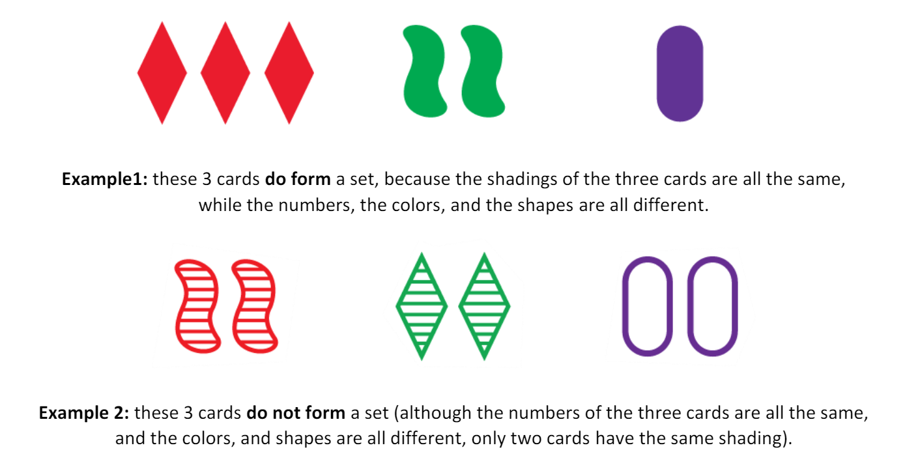
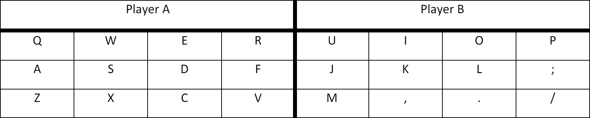

# Java Concurrency and Synchronization - Set Game Implementation

## Project Overview

This project was given to us as a second year assignment in the course Systems Programming, written by [Idan Saltzman](https://github.com/idsa0) and [Tomer Kandel](https://github.com/teramisuskandel).

This project involves implementing a concurrent version of the [card game "Set"](https://en.wikipedia.org/wiki/Set_(card_game)) in Java. The main focus is on practicing concurrent programming and synchronization mechanisms using Java Threads and Java Synchronization. The project includes building and managing the game logic, while the graphical interface and user inputs are pre-implemented.

## Game Description

### Objective
The objective of the game is to identify a set of three cards from a 3x4 grid that meet specific criteria. Each card has four features: color, number, shape, and shading. A set is valid if, for each feature, the three cards are either all the same or all different.

**example**:

### Features
- **Color:** Red, Green, Purple
- **Number of Shapes:** 1, 2, 3
- **Shape Geometry:** Squiggle, Diamond, Oval
- **Shading:** Solid, Partial, Empty

### Game Rules
1. The game starts with 12 cards dealt on a 3x4 grid.
2. Players find sets of three cards that meet the set criteria.
3. Players place tokens on the cards they believe form a set.
4. Once a player identifies a set, they ask the dealer to verify it.
5. If the set is valid, the cards are replaced with new ones from the deck, and the player scores a point. If not, the player incurs a penalty.
6. The game continues until no more sets can be formed from the remaining cards.

## Controls

The game can be played by up to two human players by using the following keys:

## Components

### Dealer
- Manages the game flow.
- Deals cards to the table.
- Shuffles and collects cards.
- Checks if sets are valid.
- Maintains the countdown timer.
- Awards points and imposes penalties.
- Announces the winner when the game ends.

### Players
- Each player is represented by a thread.
- Players can be human (using keyboard input) or non-human (simulated by threads).
- Players place and remove tokens to identify sets.
- Players notify the dealer to check their sets automatically upon placing three tokens.

### Table
- A data structure holding the cards in a 3x4 grid.
- Keeps track of which tokens are placed by which players.

### User Interface
- Displays the game grid, player scores, and a countdown timer.
- Manages keyboard inputs for human players.

## Project Structure

The project follows a Maven structure, and the main components include:

- **src/main/java/bguspl/set/ex**: Contains the game logic.
- **src/test**: Contains the unit tests.
- **pom.xml**: Maven configuration file.

### Execution Flow
1. **Initialization**: The `Main` class loads components and starts the dealer thread.
2. **Gameplay**: Players place tokens and notify the dealer to check sets.
3. **Dealer Actions**: The dealer verifies sets, deals new cards, and maintains the game state.
4. **Game End**: The dealer announces the winner when no more sets are available.

## Building and Running

To build and run the project, use the following Maven commands in the project root directory:

- **Compile**: `mvn compile`
- **Run**: `mvn exec:java`
